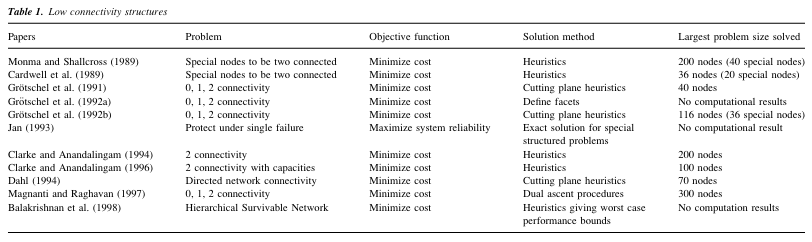

# Построение надёжной электрической цепи минимальной стоимости(SNDP)

## Оглавление
 - [Введение](#введение)
 - [Сборка проекта](#сборка-проекта)
 - [Системные требования](#системные-требования)
 - [Математическая модель](#математическая-модель)
    - [Первое приближение](#первое-приближение)
    - [Эвристика для отказоустойчивости](#эвристика-для-добавления-отказоустойчивости)
    - [Эвристика для связности графа](#эвристика-для-связности-графа)
 - [Структура проекта](#структура-проекта)
    - [Диаграмма классов](#диаграмма-классов)
 - [Анализ](#анализ)
 - [Источники](#источники)


## Введение
Проект нацелен на то, чтобы разработать [математическую модель](#математическая-модель) линейного программирования для решения задачи построения надёжной электрической цепи минимальной стоимости **Survivable Network Design Problem(SNDP)** и протестировать [предложенные эвристики](#эвристика-для-добавления-отказоустойчивости).

Также работа подразумевает [анализ](#анализ) смежных статей по этой теме и написание дипломной работы.


## Сборка проекта

Чтобы собрать проект вам нужно владеть лицензией программного пакета "CPLEX".

Чтобы собрать проект, в **Makefile** нужно изменить значения:

```
...
CPLEXDIR      = ../../programs/cplex/cplex/
CONCERTDIR    = ../../programs/cplex/concert/
...
```

Затем собрать проект командой:
```
make
```

## Системные требования
 - Компилятор g++ (GCC) 15.2.1 или новее
 - Лицензия CPLEX 12.6.1 или новее
 - GNU Make 4.4.1 или новее

# Математическая модель

ЕСЛИ LATEX НЕ ОТОБРАЖАЕТСЯ: [ДИПЛОМ](./resources/doc/диплом.pdf)

## Первое приближение

$min \sum_{i = 0}^{N}\sum_{j = 0}^{N} C_{ij} y_{ij}$

$\forall k \in S\space\sum_{i \in in(k)} f_{ik} - \sum_{j \in out(k)} f_{kj} = d_k$

$\forall i,j \in I f_{ij} \leqslant u_{ij}\cdot y_{ij}$

$\sum y_{ij} \geqslant 2$

## Эвристика для добавления отказоустойчивости

$\forall S \subset V\space\sum\limits_{\substack{i \in S\\j \in V \backslash S}} y_{ij}\geqslant - \dfrac{\sum\limits_{k \in S} P_{k} - \sum\limits_{k \in S} d_{k} - P_{k}^{*}}{u^{*}}$

## Эвристика для связности графа

$\forall S \in V \sum\limits_{\substack{i \in S\\ j \in V\backslash S}} y_{ij} \geqslant 1$

# Структура проекта

## Диаграмма классов


# Анализ
В данном разделе написаны заметки из статей по смежным темам. Его можно не читать, если вы хотите разобраться в работе программы или математической модели. Он нужен скорее для того, чтобы смотреть на проблему более широко.

# Survivable Network Design: The State of the Art

SNPD делится на два класса:
 - Физическая надёжность
 - Логическая надёжность

**Физическая надёжность**
: рассматривает
жизнеспособность сети на более высоких уровнях
(т.е., сетевом уровне или выше в модели OSI).
Таким образом, логическая живучесть предполагает, что
базовая физическая сеть является живучей. Следовательно, если
произойдет отказ оборудования, логическая надежность
обеспечит наличие альтернативных маршрутов,
по которым могут передаваться данные.


**Логическая надёжность**
 В нашем случае нас интересует именно физическая надёжность. Так как данная задача широко решалась при развитии интернета, существует отдельная категория логической устойчивости, которая означает 

Нас интересуею именно физический уровень. Он, в свою очередь, делится на:
- Структуры с низким уровнем связности
- Сетчатая структура

Модели с низкой степенью связности обычно
включают ограничения, требующие, чтобы каждый узел в
сети имел требование к связности 1 или 2.
Эти структуры способны обрабатывать один
отказ. Когда это ограничение ослабляется и требуется более высокая степень связности, получается сеть с
сетчатой ​​структурой.

Нас интересуют именно структуры с низким уровнем связности.

Известные и важные работы на эту тему до 1999 года:



# An Iterative Rounding 2-Approximation Algorithm for the Element Connectivity Problem

В статье самое важное - это целочисленная формулировка задачи ELC-SNDP и алгоритм

## Модель

R - терминальные(конечные вершины)
Q - не терминальные

$S \subset V \space E(S) = \lbrace(u, v)\subset E \space|\space u,v \subset S\rbrace$

## Модель EC-SNDP

$min\space\sum_{e \in E} c(e)\cdot x(e)$

$x(S)\leqslant g(S)\space\forall S\subset V $

$x(e) \in \lbrace 0,1\rbrace\space \forall e \in E$


## Модель WTS

$min \sum_{e \in E} c(e)\cdot x(e)$

$x(S, S') \geqslant f(S, S')$

$\forall S, S' \subset V, S \cap S' = \emptyset$

$V - S - S' \subset Q$

## Модель RES
$min \sum c(e)x(e)$

$x(S, S') \geqslant f(S, S') - \vert\delta_F (S, S')\vert$

$\forall S, S' \in V S\cap S' = \emptyset$

$V - S - S' \subset Q$

$\forall e \in E_{res}$

$0 \leqslant x(e) \leqslant 1$
